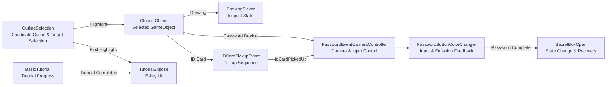
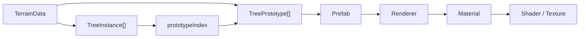

# 🦋 Name of Butterfly

> 환경 오브젝트와 상호작용하며 단서를 수집하고 퍼즐을 해결하는 1인칭 3D 어드벤처 게임


폐허가 된 우주선과 숲, 연구소를 탐험하며 주변 환경을 정리하고
ID Card, Password Device, Drawing 등의 오브젝트와 상호작용해 스토리를 진행합니다.

| | |
|---|---|
| Platform | Windows / macOS / WebGL Porting |
| Engine | Unity 2022.3.10f1 |
| Tech | C#, URP, Unity Editor API |
| Role | Client Developer |
| Team | 6 members / Client 2 |
| Period | 2023.09 - 2024.01 / WebGL Porting 2026.08 |

> This repository is a personal optimization and WebGL-porting fork of a team project.
> The sections below focus on the interaction code I contributed to and the refactoring and porting work I performed in this fork.

---

## My Contribution

- **Target Selection & Interaction**
  상호작용 후보를 탐색하고 현재 대상과 Outline 상태를 관리하는 로직 구현 및 리팩토링

- **Camera / Input-Controlled Sequence**
  Drawing, ID Card, Password 상호작용의 카메라 이동과 플레이어 입력 차단·복구 처리

- **Runtime / UI Rendering Optimization**
  매 프레임 Scene 전체 검색과 런타임 Outline 생성을 제거하고, 후보·컴포넌트 참조 캐시와 Sprite Atlas 적용

- **WebGL Porting & Editor Automation**
  TerrainData의 공유 Prototype 참조를 분석하고 WebGL용 Prefab·Material 변환 도구 구현

## System Architecture

Target Selection부터 오브젝트별 Interaction과 상태 복구까지
다음과 같은 흐름으로 연결됩니다. `BasicTutorial`의 완료 상태는
상호작용 자체가 아니라 E-key Tutorial UI를 표시하는 조건으로 사용됩니다.



`OutlineSelection`은 각 후보의 `GameObject`, `Outline`, `Transform`과
상호작용 전 위치·회전을 `SelectableInfo`에 함께 보관합니다.

```csharp
public struct SelectableInfo
{
    public GameObject obj;
    public Outline outline;
    public Transform transform;
    public Vector3 originPos;
    public Quaternion originRot;
}
```

공통 선택 계층은 `ClosestObject`를 제공하고,
Drawing·ID Card·Password Controller가 대상의 tag와 현재 상태에 따라 각 시퀀스를 실행합니다.

---

## Core Components

### 01. Target Selection & Highlight

초기화 시 상호작용 tag별 후보와 필요한 Component 참조를 캐시합니다.
매 프레임에는 캐시된 후보를 순회하여 거리 기준 최근접 대상을 찾습니다.

```text
Cached Candidates
       ↓
O(N) Squared-Distance Search
       ↓
Nearest Candidate
       ↓
Screen Bounds Check
       ↓
ClosestObject + Outline / Sound / Tutorial UI
```

현재 Target Search는 후보 수에 비례하는 `O(N)`입니다.
Scene 전체 검색과 임시 후보 컬렉션 생성은 초기화 이후의 반복 경로에서 제거했습니다.

```csharp
foreach (var info in selectableInfos)
{
    if (info.obj == null || !info.obj.activeInHierarchy) continue;

    float sqrDistance =
        (info.transform.position - cameraPosition).sqrMagnitude;

    if (sqrDistance <= maxSqrDistance &&
        sqrDistance < closestSqrDistance)
    {
        closest = info;
        closestSqrDistance = sqrDistance;
    }
}
```

**Code:** [`OutlineSelection.cs`](Assets/05.Scripts/1-1.Spacecraft/OutlineSelection.cs)
— `CacheSelectableObjects()`, `FindClosestInfo()`, `ProcessHighlight()`

### 02. Camera / Input-Controlled Interaction

오브젝트 조사와 Password 이벤트는 같은 제어 순서를 따릅니다.

```text
Input Validation
      ↓
Object / Camera State Save
      ↓
PlayerController Disabled
      ↓
Object or Camera Movement
      ↓
Interaction
      ↓
State Restore + PlayerController Enabled
```

`DrawingPicker`는 E 입력마다 조사 상태를 전환합니다.

```csharp
switch (currentState)
{
    case ObjectState.None:
        EnterInspectMode(currentObject);
        currentState = ObjectState.FacingFront;
        break;
    case ObjectState.FacingFront:
        RotateObject(currentObject);
        currentState = ObjectState.FacingBack;
        break;
    case ObjectState.FacingBack:
        ExitInspectMode(currentObject);
        currentState = ObjectState.None;
        break;
}
```

조사를 종료하면 `SelectableInfo`에 저장된 위치와 회전을 복구하고
비활성화했던 `PlayerController`를 다시 활성화합니다.

**Code:** [`DrawingPicker.cs`](Assets/05.Scripts/1-1.Spacecraft/DrawingPicker.cs)
— `EnterInspectMode()`, `ExitInspectMode()`, `ResetObjectPosition()`

### 03. Interaction Sequence & Feedback

ID Card 획득부터 Password 입력까지 시간 순서가 필요한 연출은 Coroutine으로 구성했습니다.
Coroutine 자체를 성능 개선 수단으로 사용한 것이 아니라,
입력 차단과 연출, 상태 변경, 복구의 실행 순서를 관리하는 데 사용했습니다.

```csharp
IEnumerator ActivateIDCardSequence(GameObject idCardObject)
{
    ActivateIDCard();
    MoveCameraToDesiredPosition();

    yield return StartCoroutine(InsertIdCard(idCardObject));
    PlaySound(idCardObject);
    yield return new WaitForSeconds(3f);

    ResetCameraPositionAndRotation();
    HandlePasswordActivation();
    DeactivateIDCard();

    hasIDCardInserted = true;
    eventInProgress = false;
}
```

- ID Card 선택 시 플레이어 입력 차단 및 손·손가락 연출
- 카드 획득 후 `IdCardPickedUp` 상태 갱신
- Password Device 진입 시 카메라 Transform 저장 및 고정
- Password Button 입력 시 `MaterialPropertyBlock` 기반 Emission 피드백
- 성공 시 Box 상태 변경 후 카메라와 플레이어 입력 복구
- Tutorial UI의 Fade/Hide Coroutine handle을 관리하여 중복 실행 방지

**Code:** [`IDCardPickupEvent.cs`](Assets/05.Scripts/1-1.Spacecraft/IDCardPickupEvent.cs),
[`PasswordEventCameraController.cs`](Assets/05.Scripts/1-1.Spacecraft/PasswordEventCameraController.cs)

---

## Runtime Optimization

Portfolio에서는 Profiler로 관찰한 최초 Interaction과 반복 실행 구간을 설명합니다.
이 README에서는 측정 수치를 직접 비교하기보다 Git history로 확인되는 코드 구조 변경에 집중합니다.

### Change 01. Remove Scene-wide Search from Update

기존에는 매 프레임 모든 `GameObject`를 검색하고,
상호작용 tag에 해당하는 대상을 새로운 List와 Array로 구성했습니다.

```csharp
// Before
GameObject[] allObjects = GameObject.FindObjectsOfType<GameObject>();
List<GameObject> selectedObjects = new List<GameObject>();

foreach (string tag in tags)
{
    foreach (GameObject obj in allObjects)
    {
        if (obj.CompareTag(tag)) selectedObjects.Add(obj);
    }
}

return selectedObjects.ToArray();
```

후보 수집을 초기화 시점으로 이동하여 반복 경로에서는 캐시된 목록만 사용하도록 변경했습니다.

```csharp
private List<SelectableInfo> selectableInfos = new List<SelectableInfo>();

void Awake()
{
    CacheSelectableObjects();
}
```

- Scene-wide search를 매 프레임 실행하던 구조 제거
- 반복적인 임시 List와 결과 Array 생성 제거
- `Camera.main`과 최대 거리의 제곱값 캐싱

**Git:** [`f111a96`](https://github.com/dazzang22/NoB-Client-Optimization/commit/f111a96)

### Change 02. Pre-attached Component & Reference Cache

기존에는 선택된 오브젝트에 `Outline`이 없으면 상호작용 시점에 Component를 추가했습니다.

```csharp
// Before
Outline outline = obj.AddComponent<Outline>();
outline.enabled = true;
```

이를 Scene/Prefab에 사전 부착된 `Outline`을 초기화 시 조회하고,
상호작용 시에는 캐시된 참조의 `enabled` 상태만 제어하도록 변경했습니다.

```csharp
selectableInfos.Add(new SelectableInfo
{
    obj = obj,
    outline = obj.GetComponent<Outline>(),
    transform = obj.transform
});
```

- 최초 선택 시점의 동적 Component 생성 제거
- 반복 `GetComponent<Outline>()`와 `transform` 조회 감소
- 원래 위치와 회전을 함께 저장하여 Interaction 종료 시 복구

**Git:** [`f111a96`](https://github.com/dazzang22/NoB-Client-Optimization/commit/f111a96),
[`6046579`](https://github.com/dazzang22/NoB-Client-Optimization/commit/6046579),
[`5371840`](https://github.com/dazzang22/NoB-Client-Optimization/commit/5371840)

### Change 03. Distance First, Screen Check Once

기존에는 거리 범위에 포함된 각 후보를 Screen Space로 변환하며
화면 안에 있는 가장 가까운 대상을 찾았습니다.

현재는 먼저 캐시된 후보 전체의 제곱 거리를 비교하고,
선택된 최근접 후보 한 개만 화면 좌표로 변환합니다.

```csharp
if (closest.HasValue)
{
    Vector3 screenPoint =
        mainCamera.WorldToScreenPoint(closest.Value.transform.position);

    if (!(0 <= screenPoint.x && screenPoint.x <= Screen.width &&
          0 <= screenPoint.y && screenPoint.y <= Screen.height))
    {
        return null;
    }
}
```

후보 탐색 자체는 `O(N)`을 유지하지만,
후보별로 수행되던 screen-coordinate conversion을 최종 후보 한 개로 제한했습니다.

**Git:** [`6046579`](https://github.com/dazzang22/NoB-Client-Optimization/commit/6046579)

---

## Rendering Optimization

### Sprite Atlas

Tutorial UI에서 사용하는 13개의 Sprite를 하나의 Sprite Atlas로 구성했습니다.

- Movement: `move-a`, `move-w`, `move-s`, `move-d`
- Input: `EKey`, `Shift`, `Ctrl`, `SpaceBar`, `Scroll`, `R`
- Tutorial UI: `PlayerControlUI`, `2`, `9`

Repository에서는 Atlas 에셋과 포함 Sprite를 직접 확인할 수 있습니다.
Portfolio의 RenderOverlays와 Batch 수치는 동일 카메라·UI 조건에서 기록한
Frame Debugger measurement이며, Atlas 에셋만으로 도출한 수치는 아닙니다.

**Asset:** [`New Sprite Atlas.spriteatlas`](Assets/07.UI/Tutorial/New%20Sprite%20Atlas.spriteatlas)
**Git:** [`6046579`](https://github.com/dazzang22/NoB-Client-Optimization/commit/6046579)

---

## WebGL Porting & Editor Automation

### Rendering Issue

PC 환경에서 정상적으로 보이던 Terrain vegetation이 WebGL 포팅 후
마젠타로 렌더링되는 현상을 Portfolio의 실행 화면에서 확인했습니다.

Repository에는 특정 Shader 하나를 원인으로 단정하는 대신,
Terrain이 참조하는 Prefab·Material·Shader 경로를 WebGL-compatible asset으로
변환하기 위한 Editor Tool과 생성 결과를 포함합니다.

### Asset Reference Investigation

Terrain의 나무는 각 Instance가 Prefab을 직접 소유하지 않습니다.
`TreeInstance.prototypeIndex`가 `TerrainData.treePrototypes`의 공유 항목을 가리키고,
해당 `TreePrototype`이 실제 Prefab을 참조합니다.



### Engineering Decision

개별 `TreeInstance`를 수정하지 않고,
여러 Instance가 공유하는 `TreePrototype.prefab` 참조를 변환 단위로 선택했습니다.

```text
Instance-level Modification   X
Shared Prototype Reference    O
```

이 방식은 Instance의 위치·회전·크기와 `prototypeIndex`를 유지하면서
공유 Prefab과 그 하위 Material만 WebGL용 에셋으로 교체합니다.

### Editor Tool

`NoBWebGLTreeConverter`는 다음 과정을 자동화합니다.

1. Source Prefab과 WebGL replacement Prefab의 mapping 생성
2. 원본 Mesh를 재사용하는 Tree Prefab 생성
3. 기존 Material의 Texture와 색상 정보를 URP/Lit Material로 이전
4. Leaves Material에 Alpha Clipping 설정
5. `treePrototypes`와 `detailPrototypes`의 Prefab 참조 교체
6. AZURE Nature의 Tree·Rock과 Water Material 변환
7. 변경된 TerrainData와 생성 Asset 저장

```csharp
var prototypes = terrainData.treePrototypes;

for (var i = 0; i < prototypes.Length; i++)
{
    if (prototypes[i].prefab != null &&
        replacements.TryGetValue(prototypes[i].prefab, out var replacement))
    {
        prototypes[i].prefab = replacement;
    }
}

terrainData.treePrototypes = prototypes;
EditorUtility.SetDirty(terrainData);
```

Codex는 프로젝트의 Asset reference 탐색과 반복적인 Editor Tool 구현을 보조했으며,
수정 범위 결정, TerrainData API 검증, Tool 실행과 WebGL 결과 확인은 직접 수행했습니다.

### Verification

- `NoBWebGLTreeConverter` source가 repository에 포함됨
- WebGL용 Tree Prefab과 URP/Lit Material이 지정된 output path에 생성됨
- 기존 output Material이 있으면 같은 path에서 값을 갱신하도록 구성
- 변환된 Prefab을 참조하는 TerrainData 변경이 commit에 포함됨
- WebGL 실행 결과는 Portfolio의 Before / After 화면으로 별도 제시

**Code:** [`NoBWebGLTreeConverter.cs`](Assets/TutorialInfo/Scripts/Editor/NoBWebGLTreeConverter.cs)
**Generated Assets:** [`WebGL Trees`](Assets/04.Asset/Mini%20Nature%20Pack/Models/WebGL%20Trees)
**Git:** [`1938b7d`](https://github.com/dazzang22/NoB-Client-Optimization/commit/1938b7d)

---

## Code Navigation

| Area | Code | Responsibility |
|---|---|---|
| Target Selection | [`OutlineSelection.cs`](Assets/05.Scripts/1-1.Spacecraft/OutlineSelection.cs) | 후보 캐시, `O(N)` 최근접 탐색, 화면 판정 및 Highlight 관리 |
| Object Inspection | [`DrawingPicker.cs`](Assets/05.Scripts/1-1.Spacecraft/DrawingPicker.cs) | Drawing 조사 상태 전환과 Transform·입력 복구 |
| ID Card Sequence | [`IDCardPickupEvent.cs`](Assets/05.Scripts/1-1.Spacecraft/IDCardPickupEvent.cs) | 카드 획득, 손 연출, Sound·Emission 및 상태 갱신 |
| Camera / Input Control | [`PasswordEventCameraController.cs`](Assets/05.Scripts/1-1.Spacecraft/PasswordEventCameraController.cs) | 카메라 저장·이동·복구와 Password 진입 시퀀스 |
| Password Feedback | [`PasswordButtonColorChanger.cs`](Assets/05.Scripts/1-1.Spacecraft/PasswordButtonColorChanger.cs) | Raycast 입력, MaterialPropertyBlock 피드백 및 성공 상태 관리 |
| WebGL Editor Automation | [`NoBWebGLTreeConverter.cs`](Assets/TutorialInfo/Scripts/Editor/NoBWebGLTreeConverter.cs) | Terrain Prototype, Prefab, Material 일괄 변환 |

---

## Contribution Scope

> This repository is a personal optimization and WebGL-porting fork of a six-member team project.

팀 프로젝트 기간에는 Spacecraft Scene의 Target Selection, Drawing 조사,
ID Card / Password 상호작용, 카메라·플레이어 입력 제어와 Tutorial UI 흐름에 기여했습니다.
Git history에서는 해당 코드에 대한 반복적인 구현·수정과 이후 리팩토링을 확인할 수 있습니다.

개인 fork에서는 다음 작업을 수행했습니다.

- `OutlineSelection`, `DrawingPicker`, `TutorialExpose` 실행 구조 리팩토링
- 매 프레임 Scene 전체 검색과 임시 후보 컬렉션 생성 제거
- 런타임 Outline 생성 제거 및 Component/Transform 참조 캐싱
- 최근접 후보 우선 화면 판정과 Tutorial Sprite Atlas 구성
- Terrain Prototype 기반 WebGL Prefab·Material 변환 도구 구현 및 결과 검증

명시하지 않은 게임 시스템과 환경 아트·레벨 구성에는 다른 팀원의 작업이 포함됩니다.
`Quick Outline`의 기반 구현은 Chris Nolet이 제작한 third-party asset이며,
이 repository에서 설명하는 제 기여는 이를 사용하는 Target Selection과 Runtime 초기화 경로의 개선입니다.

---

## Links

- [Portfolio Repository](https://github.com/dazzang22/dazzang2-lab)
- [Original Team Repository](https://github.com/lotia20/Name_Of_Butterfly_new)
